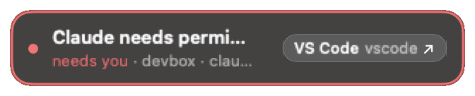

# needs-you

One inbox for "you have to do something". AI agents, servers and CI post an item when they're blocked on you; your Mac shows it in a small floating pill, with a link to where you act, and it disappears once it's handled.

needs-you has three parts:

| Part | What it does | Where it runs |
|---|---|---|
| **The Needs You app** | Shows your alerts: the pill and the panel | Your Mac |
| **A hub** | Stores alerts and hands them to the app. One Python file, SQLite, standard library only | Built into the app, on by default. Optionally also on a server you run, always on |
| **Senders** | Post alerts when something needs you, and clear them when it's handled: the `needs-you` command, agent hooks, the MCP server, CI and cron jobs, the GitHub poller | Any machine where agents or jobs run, the Mac included |

```
 senders (any machine)              your Mac
 needs-you CLI, agent hooks,  ───►  the Needs You app
 MCP server, CI, GitHub poller       ├─ built-in hub: stores alerts
          │                          └─ pill and panel: show them
          └──► optional: a server hub, always on (HUB.md)
```

With the built-in hub there's nothing else to run: no server, no account, no cloud. Senders don't need the app, only the `needs-you` command (one Python file), which an invite link installs; if no hub answers (the Mac is asleep, say) it keeps the alert in a local outbox and sends it later. A server hub is optional, so alerts land while the Mac sleeps; most people don't need one. It's light: the idle hub uses under 1% of one CPU core and about 30 MB of memory ([measured](docs/HUB.md#resource-use)). More, with the three ways to place the hub: [App, hubs and senders](docs/guides/concepts.md).

<p>


</p>

## Works with

Each agent gets a card when it's waiting on you, and the card clears itself when you answer. Add the flag to an invite link's one-liner, or paste the link's agent prompt into the agent ([Add a sender](docs/guides/add-a-sender.md)).

| Agent or tool | Card when | Install flag | Guide |
|---|---|---|---|
| Claude Code | It asks for permission, a plan approval or an answer, waits for your next message, or stops on an API error | `--claude-hooks user --skill` | [Claude Code](docs/guides/claude-code.md) |
| OpenAI Codex CLI | It asks to run a command, apply an edit or call an MCP tool, or finishes its turn | `--codex-hooks user` | [Codex](docs/guides/codex.md) |
| Gemini CLI | It asks to approve a command, an edit, an MCP tool or a fetch, or finishes its turn | `--gemini-hooks user` | [Gemini](docs/guides/gemini.md) |
| opencode | It asks for permission or asks a question, or goes idle | `--opencode-plugin` | [opencode](docs/guides/opencode.md) |
| GitHub Copilot CLI | It asks for permission or asks a question, or finishes its turn | `--copilot-hooks user` | [Copilot](docs/guides/copilot.md) |
| Kimi Code | It asks to approve a command, an edit or a plan, asks a question, finishes its turn or stops on an error | `--kimi-hooks user` | [Kimi Code](docs/guides/kimi.md) |
| Grok Build | It shows a permission prompt, waits for your next message, or stops on an error | `--grok-hooks user` | [Grok Build](docs/guides/grok.md) |
| Cursor | It finishes its turn or stops on an error (Cursor has no hook for approval prompts) | `--cursor-hooks user` | [Cursor](docs/guides/cursor.md) |
| Cline (VS Code and CLI) | A task finishes or fails (no hook for approval prompts) | `--cline-hooks user` | [Cline](docs/guides/cline.md) |
| Aider | It waits for you after a reply (clears when Aider exits, or after an hour) | `--aider` | [Aider](docs/guides/aider.md) |
| Any MCP agent | The agent calls `needs_you_add` itself; for agents with MCP but no shell | `--mcp claude,codex,gemini,opencode,copilot,cursor` | [MCP server](docs/guides/mcp.md) |
| Orca | Automations post blockers and run summaries; agent cards get a **Terminal** button | `--orca` | [Orca](docs/guides/orca.md) |
| GitHub | Review requests, deploy approvals, failed CI, your PRs ready to merge or blocked, and an FYI when one merges | a poller on one machine | [GitHub](docs/guides/github.md) |
| CI, cron, scripts | A job fails, or a long one finishes (`needs-you run`) | the CLI | [Add a sender](docs/guides/add-a-sender.md#cron-systemd-ci) |

Anything that can run a shell command can post. Any other agent or tool with hooks, webhooks or a notification command can be connected with a [custom connector](docs/guides/custom-connector.md). Add `--alerts` as well: it turns agent cards on for every session on that machine (inside Orca they're on already).

Open source, [Apache-2.0](LICENSE). **Status: early preview (0.1.x).**

## Get started

Trying it out? Start with **[the tester guide](docs/guides/testers.md)**: download, first run and how to report problems, on one page. Every guide is also on the site, in reading order: **[needsyou.app/guides](https://needsyou.app/guides/)**.

Words used below: **the app** shows your alerts on the Mac; the **hub** stores them (the app has one built in); a **sender** is any machine or agent that posts them, with only the `needs-you` command, no app; your **tailnet** is your private [Tailscale](docs/guides/tailscale.md) network, which lets other machines reach the Mac. Reader, owner, server hub and the rest: [App, hubs and senders](docs/guides/concepts.md).
**Or let an agent do it.** Paste this prompt into Claude Code (or Codex, Gemini CLI, any agent that runs shell commands) on your Mac, and later on each server. It installs the app, connects the agents it finds, and posts a test card, asking you at every choice ([Set it up with an agent](docs/guides/setup-with-an-agent.md)):

<details>
<summary>The "set up needs-you for me" prompt</summary>

```text
Set up needs-you for me on this machine. needs-you is a small inbox for "a person has to do something": agents and jobs post an alert when they're blocked on me, and the Needs You app on my Mac shows it. Guide: https://needsyou.app/guides/setup-with-an-agent.html. Source: https://github.com/tayharris/needs-you.

Rules for you, the whole way through:
- Where a step says ASK, stop, ask me, and wait. Never answer for me or pick a default I didn't choose.
- Look before you change anything, and only read: no installing system-wide, no sudo, no logging in to anything, no editing any agent's config yourself. The needs-you installer makes the config changes.
- Never print, paste or save a token or an invite code. Only the installer writes them (to ~/.config/needs-you/env). Don't repeat my invite link back to me. Never open credential files (auth.json, .credentials.json, hosts.yml, anything in the Keychain).

1. Look around (read-only), then show me a short list:
   - The OS: uname -s, and sw_vers -productVersion on a Mac.
   - needs-you already here? If ~/.local/bin/needs-you exists, run ~/.local/bin/needs-you doctor.
   - On a Mac, Needs You: /Applications/NeedsYou.app or ~/Applications/NeedsYou.app (or mdfind "kMDItemCFBundleIdentifier == 'app.needsyou.mac'"), its version (CFBundleShortVersionString in Contents/Info.plist), and whether it's running (pgrep -f NeedsYou.app/Contents/MacOS/NeedsYou). The latest release: curl -fsSIL -o /dev/null -w '%{url_effective}' https://github.com/tayharris/needs-you/releases/latest
   - Tailscale: tailscale status --json (on a Mac the command may be /Applications/Tailscale.app/Contents/MacOS/Tailscale). Report only BackendState, Self.DNSName and how many peers.
   - Agents and tools: which of these are on PATH, or have their folder: claude (~/.claude), codex (~/.codex), gemini (~/.gemini), opencode (~/.config/opencode), copilot (~/.copilot), kimi (~/.kimi-code), grok (~/.grok), cursor or cursor-agent (~/.cursor), cline (~/Documents/Cline), aider (~/.aider.conf.yml), orca, gh. For accounts, run only status commands that print no secrets (gh auth status, codex login status); otherwise say only whether the folder exists.

2. Explain, in a few sentences and these words: the app runs on my Mac and shows alerts in a small pill at the top of the screen. A hub stores the alerts; the app has one built in, so there's nothing else to run. Senders are the machines and agents that post alerts with the needs-you command; they join with an invite link from the app. A server hub is optional: the same hub, always on, on a Linux server, so alerts land while the Mac sleeps. Tailscale is only needed so other machines can reach this Mac's hub.

3. The app (Mac only; on any other OS skip to step 5, because the app runs on my Mac and this machine becomes a sender).
   - Installed and the latest: say so, and open it if it isn't running (open -g -a <its path>).
   - Missing or older: ASK "Install Needs You <version> to /Applications?", or "Replace Needs You <old> at <path> with <new>? The old copy is kept as NeedsYou.app.previous". On yes: in a new empty temp folder, download NeedsYou-<version>-macos.zip and SHA256SUMS from https://github.com/tayharris/needs-you/releases/download/v<version>/ with curl -fL. Run shasum -a 256 -c SHA256SUMS --ignore-missing and stop if the zip isn't OK. Unpack with ditto -x -k <zip> <folder>/app. Install with the app's own installer: <folder>/app/NeedsYou.app/Contents/Resources/scripts/install.sh --app <folder>/app/NeedsYou.app. Add --dest ~/Applications if /Applications isn't writable without sudo. It quits a running copy, swaps the new one in, keeps the previous one and opens the new one.
   - A curl download carries no quarantine flag, so macOS shouldn't block it. If xattr -p com.apple.quarantine <app> shows one, ASK, then remove it from that app only: xattr -dr com.apple.quarantine <app>. Never turn Gatekeeper off or change security settings.
   - Tell me: a faint pill appears at the top right of the screen. If macOS asks whether python3 may accept incoming connections, choose Allow (that's the built-in hub). If the app says Python 3 isn't available, ASK before running xcode-select --install (it opens Apple's installer).

4. Other machines (Mac only). ASK: "Should other machines (servers, a devbox, CI) send alerts to this Mac?" If yes and Tailscale isn't installed or logged in, tell me to install it from https://tailscale.com/download and log in myself, then check again. Don't install it or log in for me. Then ASK: "Do you want an always-on server hub too? Most people don't." If yes, point me to https://needsyou.app/guides/hub.html: it's set up on the server, not from here.

5. Senders. Show me the agents and tools you found in step 1, and what each gets, then ASK which ones to connect (none is fine):
   - Claude Code: --claude-hooks user --skill
   - Codex: --codex-hooks user
   - Gemini CLI: --gemini-hooks user
   - opencode: --opencode-plugin
   - GitHub Copilot CLI: --copilot-hooks user
   - Kimi Code: --kimi-hooks user
   - Grok Build: --grok-hooks user
   - Cursor: --cursor-hooks user
   - Cline: --cline-hooks user
   - Aider: --aider
   - Orca: --orca
   Add --alerts when I pick any agent (cards from every session, not only Orca's). Then ASK about each extra, and add it only on a yes: --usage (a card when Claude Code's 5-hour or weekly limit runs high, for Pro and Max plans), --mcp <agents> (the MCP server, for agents that should post through a tool call), --agent-instructions codex,gemini,opencode (the posting rules in their instruction files). Daily automatic updates are on by default; tell me that, and add --no-auto-update only if I ask. If gh is installed, offer the GitHub poller as a later step (https://needsyou.app/guides/github.html); don't set it up now.
   Then ASK me for an invite: in the app, click the pill, then Settings… > Connect a machine > Create invite > Agent prompt (on a new install, the pill's "Connect your first agent or machine" card has Copy agent prompt), and paste it here. On a machine other than the Mac, the invite comes from the Mac's app, and this machine must reach the Mac (step 4). Read the join page the link points to (curl -fsSL <link>; it's Markdown for agents). Then run its one-line installer with exactly the flags I picked: curl -fsSL <link>/install.sh | bash -s -- --yes <flags>. If it says the link is unknown, expired or used up, ASK me for a new one.

6. Check.
   - Run ~/.local/bin/needs-you doctor. For each WARN or FAIL line, run the next step printed under it if it's a command for this machine; otherwise tell me what it needs.
   - Post a test card: ~/.local/bin/needs-you add --key "personal:test:hello" --context personal --title "needs-you works on $(hostname -s)". Tell me what to look for: a card springs out of the pill on my Mac, and clicking the pill opens the panel with it. ASK whether I see it; if not, follow https://needsyou.app/guides/troubleshooting.html.
   - Clear it: ~/.local/bin/needs-you resolve --key "personal:test:hello". It leaves the panel within a few seconds.
   - Finish with a summary: what was installed and where, which agents need a restart to pick up their hooks (and for Codex, that I trust the needs-you hooks once in /hooks), that daily updates are on (or off), and that needs-you doctor checks everything again any time.
```

</details>

Words used below: the **hub** holds your alerts (the Mac app runs one, so your Mac is the hub); a **sender** is any machine or agent that posts them, with only the `needs-you` command, no app; your **tailnet** is your private [Tailscale](docs/guides/tailscale.md) network, which lets other machines reach the Mac. Reader, owner, server hub and the rest: [Words](docs/guides/concepts.md).

1. **Download** the latest release from the repository's [Releases page](https://github.com/tayharris/needs-you/releases) (macOS 14 or later): `NeedsYou-X.Y.Z.dmg` (open it and drag `NeedsYou.app` to `/Applications`), or `NeedsYou-X.Y.Z-macos.zip` (unzip, then drag). `SHA256SUMS` on the same page checks either: `shasum -a 256 -c SHA256SUMS`.
2. **First launch.** The app is ad-hoc signed, not notarized, so macOS blocks it once. On macOS 14 and earlier: right-click `NeedsYou.app` → **Open** → **Open**. On macOS 15 and later: double-click it, then **System Settings → Privacy & Security → Open Anyway**. The release notes have the full steps (firewall prompt, managed Macs). The built-in hub needs `/usr/bin/python3` from Apple's Command Line Tools; if Settings says Python 3 isn't available, run `xcode-select --install` and reopen the app.
3. **Connect a machine.** Right-click the pill (the small, faint shape at the top right of the screen) → **Settings…** → **Connect a machine** (under **Hubs and machines** in the sidebar) → **Create invite**, then click **Agent prompt** and paste it into Claude Code (on this Mac or any server on your tailnet), or click **Shell one-liner** and run it there. The machine installs the `needs-you` CLI and posts a test card.

Next:

- [Quickstart](docs/guides/quickstart.md): the whole setup, step by step.
- [Claude Code alerts everywhere](docs/guides/claude-code-everywhere.md): one copy-paste path to "my Claude sessions alert my Mac", on the Mac, over SSH, in tmux, VS Code Remote-SSH and Orca.
- [Tailscale](docs/guides/tailscale.md): connecting servers to the Mac.
- [Claude Code](docs/guides/claude-code.md), [Orca](docs/guides/orca.md) and [GitHub](docs/guides/github.md) integrations.
- [AGENT-GUIDE.md](docs/AGENT-GUIDE.md): the rules agents follow when they post.

To build from source instead: `mac/scripts/bundle.sh` (see [mac/README.md](mac/README.md)).

## Goal

needs-you is AI-first. It gives AI agents the tools to set themselves up (hand an agent an invite link and it installs and configures itself) and to alert a person only when they actually need that person, routed to where they act: a deep link to the ticket, the PR or the Orca terminal. Humans stay in the loop without watching terminals.

Roadmap: [docs/roadmap/](docs/roadmap/). Design decisions: [docs/adr/](docs/adr/).

## How it works, in three steps

1. **Install the Mac app.** `NeedsYou.app` is a small floating panel that all but disappears when nothing is waiting. It has a hub built in (a small SQLite database behind a tiny web server) that stores your alerts, so there's nothing else to set up.
2. **Connect Claude Code on the Mac.** Right-click the pill → **Settings…** → **Connect a machine** → **Create invite**, copy the **Agent prompt**, and paste it into Claude Code: *"Set up needs-you alerts on this machine: read &lt;link&gt; and follow it."* The agent reads the link, installs the `needs-you` CLI, and from then on posts when it's blocked on you.
3. **Connect servers over Tailscale.** Each one becomes a sender. Same thing on any VM, devbox or CI runner: paste the prompt into its agent, or run the one-liner the link gives you. One link can set up several machines; each gets its own revocable token.

```
 agents, CI, cron          needs-you CLI                 your Mac
 on servers or the Mac ──► (fails over, queues  ──────►  NeedsYou.app
                            while the Mac sleeps)        └─ built-in hub (SQLite + tiny web server)
                                                             ▲
                         optional: always-on server hubs ────┘ (the app can read from them)
```

Items sent while the Mac sleeps are queued on the sender and delivered when it wakes (each sender retries every 5 minutes). If you'd rather never wait, add one or two always-on [server hubs](docs/HUB.md). Today they replicate only with each other, not with the app's built-in hub, and invites made on the Mac list only the Mac's URL; [HUB.md](docs/HUB.md#with-the-apps-built-in-hub) says how to set it up.

**[Quickstart](docs/guides/quickstart.md)** walks through all of it.

## Sending, in one minute

```bash
needs-you add --key "work:ACME-123:deploy-approval" --priority urgent \
  --title "ACME-123: approve the prod deploy" --body "Staging is green; the PR has the diff." \
  --link "PR=https://github.com/example/app/pull/42"

needs-you resolve --key "work:ACME-123:deploy-approval"     # once it's handled
```

Re-posting the same key updates the item instead of stacking duplicates, and the sender clears it once it's handled. The rules agents follow are in [AGENT-GUIDE.md](docs/AGENT-GUIDE.md).

## Guides

The same guides, grouped for a first read, are at **[needsyou.app/guides](https://needsyou.app/guides/)**.

| Guide | For |
|---|---|
| [Testers](docs/guides/testers.md) | Invited testers: access, install, first run, reporting problems |
| [Quickstart](docs/guides/quickstart.md) | The Mac app, local Claude Code, servers |
| [App, hubs and senders](docs/guides/concepts.md) | The three parts and where each runs, roles, invite links, tailnet, and the Settings page for each |
| [Set it up with an agent](docs/guides/setup-with-an-agent.md) | One prompt for Claude Code or another agent: it installs the app, connects the agents it finds, and asks you at every choice |
| [Words](docs/guides/concepts.md) | Hub, sender, reader, owner, invite link, server hub, tailnet, and the Settings page for each |
| [Mac app](docs/guides/mac-app.md) | Installing and using `NeedsYou.app` |
| [Add a sender](docs/guides/add-a-sender.md) | Invite links, the installer's options, CI and cron |
| [MCP server](docs/guides/mcp.md) | Agents with MCP but no shell: post, resolve and check the setup as tool calls |
| [Custom connector](docs/guides/custom-connector.md) | Connect any agent, tool or service: the item format, mapping its events to cards, examples, testing |
| [Claude Code](docs/guides/claude-code.md) | Hooks for "agent is waiting" and the skill: what gets installed, what each hook posts, checking and uninstalling |
| [Claude Code everywhere](docs/guides/claude-code-everywhere.md) | Alerts from local, SSH, tmux, VS Code Remote-SSH and Orca sessions |
| [Tailscale](docs/guides/tailscale.md) | Putting the Mac and servers on one tailnet, checking reachability |
| [Orca](docs/guides/orca.md) | Orca agents and automations on one or many servers: the Terminal button, keys, a hand-off example |
| [GitHub](docs/guides/github.md) | Review requests, deploy approvals, failed CI and your PRs' state, from one poller |
| [Server hubs](docs/HUB.md) | Optional always-on hubs, two-hub setup, backups |
| [Troubleshooting](docs/guides/troubleshooting.md) | When an item doesn't show up |
| [Keeping up to date](docs/guides/updates.md) | The Mac app updating itself, `needs-you update` on senders, `scripts/rollout.sh` |

Contributing: [CONTRIBUTING.md](CONTRIBUTING.md). Security reports: [SECURITY.md](SECURITY.md).

Reference: [AGENT-GUIDE.md](docs/AGENT-GUIDE.md) (the sender contract), [API.md](docs/API.md) (the HTTP API), [ADRs](docs/adr/README.md) (design decisions, starting with [0007](docs/adr/0007-founding-design.md)).

## Config

- **Hubs** are configured by a JSON text file (Python's standard library reads it; no YAML dependency) or entirely by command-line flags, plus the admin CLI `needs_you_admin.py` for tokens and invites.
- **The Mac app** holds its own list of hubs and runs its built-in hub; you never edit a file on the Mac.
- **Senders** keep `~/.config/needs-you/env` (hub URLs and a token), written for them by the invite installer.
- **No hub web UI, by design.** The `/join/<code>` pages (Markdown for agents, plus an install script) are the only browser-friendly surface.
- **Network:** Tailscale is recommended (hubs listen on loopback and the tailnet IP, never on all interfaces), but any `https` URL works. Plain `http` is only for tailnet names and local addresses.

## Requirements

- Mac: macOS 14 or later with `/usr/bin/python3` (the Command Line Tools). Tailscale if servers should reach it.
- Senders and server hubs: `bash`, `curl` and `python3` 3.9+, stock on macOS and Ubuntu 22.04+. No pip, no brew, no build step.

## Repo layout

```
needs-you/
├── hub/            needs_you_hub.py, needs_you_admin.py, join-install.sh (the invite installer)
├── cli/            needs-you: the sender CLI, one Python file
├── mac/            NeedsYou.app (Swift/SwiftUI), which runs hub/ as a child process
├── scripts/        install-hub.sh (server hubs), setup-sender.sh (manual sender setup)
├── integrations/   claude-code/ (the shared hook, skill), codex/, gemini/, opencode/, copilot/, kimi/, grok/,
│                   cursor/, cline/, aider/, orca/, mcp/ (MCP server), github/ (poller), ci/ (Actions, cron, systemd)
├── deploy/         systemd units and an example hub config
└── docs/           guides/, AGENT-GUIDE.md, API.md, HUB.md, roadmap/, adr/
```

## Future

- **GitHub org webhooks** (for example, alerts for every repo in a GitHub org): today, use the Tailscale GitHub Action to join the tailnet from a workflow and post with the CLI ([integrations/ci](integrations/ci/README.md)). Later, possibly Tailscale Funnel exposing only a narrow `/hooks` path on one hub.
