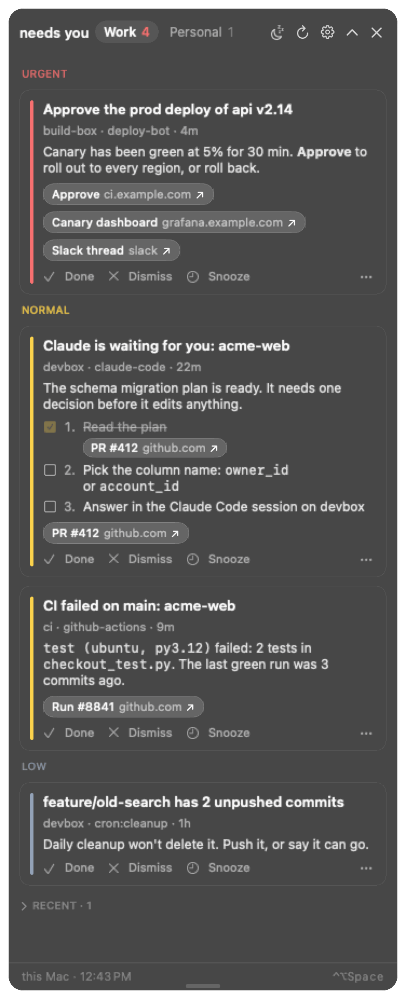
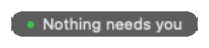
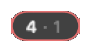
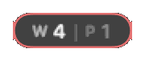
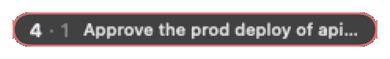
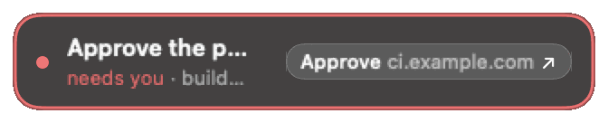
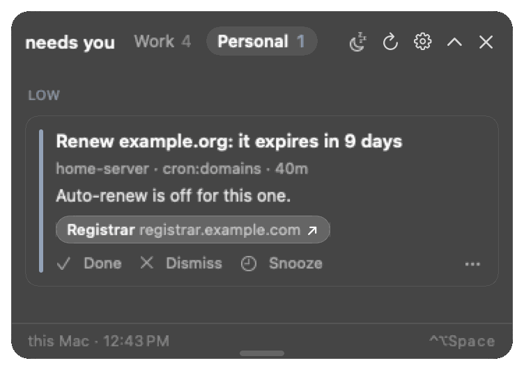
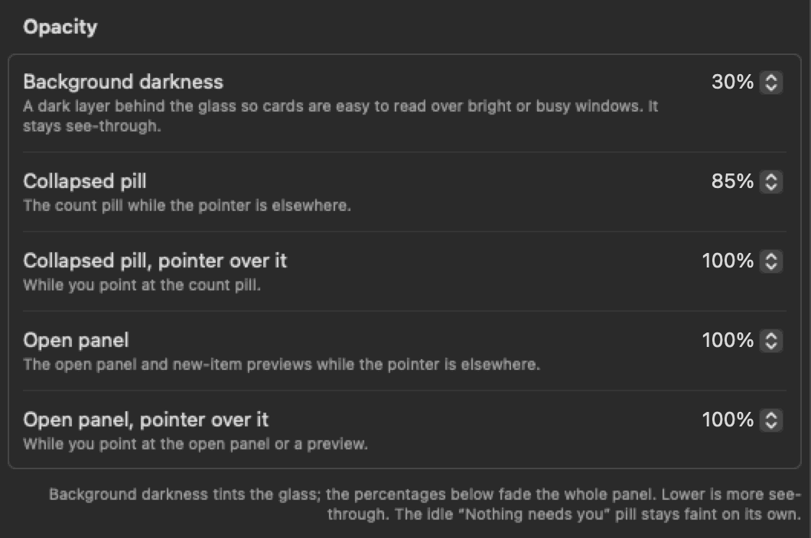
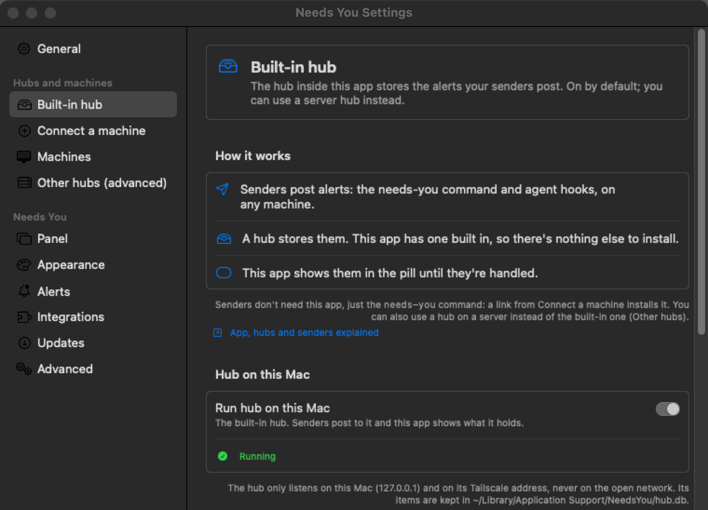
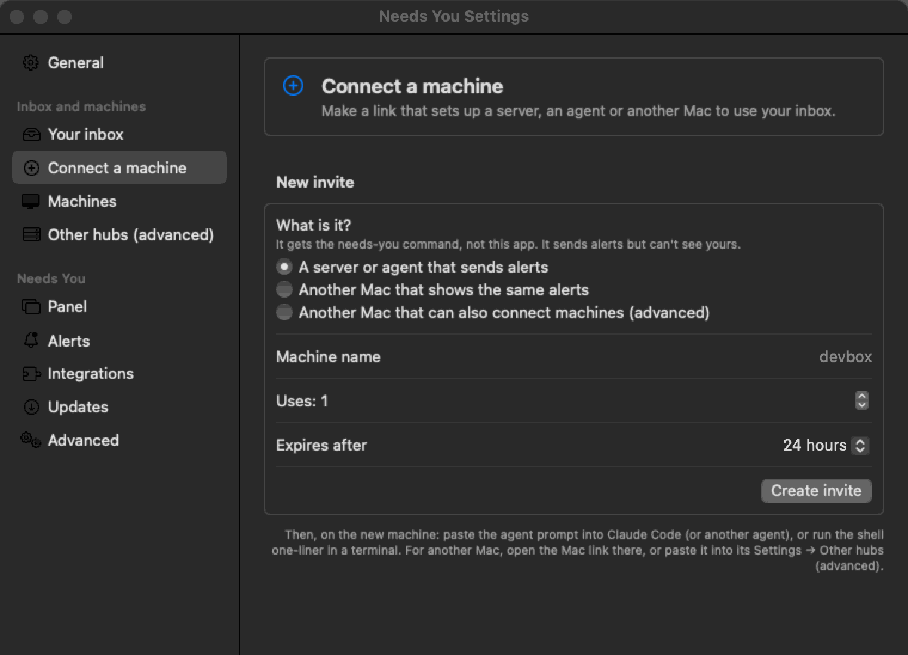

# The Mac app

`NeedsYou.app`, **the Needs You app**, is the part of needs-you that shows your alerts. It's a small floating panel (no Dock icon; an optional menu bar icon) that reads them from a hub and stays out of the way until something needs you. It has a hub built in, so it works on its own; senders on your other machines post to that hub.

Build, install and signing details live with the code: **[mac/README.md](../../mac/README.md)**. This page is the short version for users. New to the words app, hub, sender and owner? [App, hubs and senders](concepts.md) explains them.

## Install

1. Download `NeedsYou-X.Y.Z.dmg` (or `NeedsYou-X.Y.Z-macos.zip`) from the repository's **Releases** page, plus `SHA256SUMS` if you want to check it (`shasum -a 256 -c SHA256SUMS`), and check its build provenance with `gh attestation verify NeedsYou-X.Y.Z.dmg --repo tayharris/needs-you` ([release-signing.md](../security/release-signing.md)). Or build it per [mac/README.md](../../mac/README.md).
2. Drag `NeedsYou.app` to `/Applications` and open it. It's ad-hoc signed, not notarized, so macOS blocks the first launch once: on macOS 14 and earlier, right-click → **Open** → **Open**; on macOS 15 and later, double-click, then **System Settings → Privacy & Security → Open Anyway**. Or: `xattr -dr com.apple.quarantine /Applications/NeedsYou.app`. On a managed work Mac, endpoint security (e.g. SentinelOne) may flag ad-hoc signed builds; ask IT.
3. The built-in hub needs `/usr/bin/python3` (Apple's Command Line Tools). If **Settings…** says *Python 3 isn't available on this Mac*, run `xcode-select --install`, then quit and reopen the app.
4. Optional: **Settings… → General → Open at login**.

When you open Needs You yourself, the panel opens once so you can see your items and where the pill is, without taking focus from what you're typing. It closes on its own after about 10 seconds with the pointer away (pointing at it holds it open; it goes 2 seconds after the pointer leaves) or at a click anywhere else. At login, and when an update restarts the app, only the pill shows. Turn this off with **Settings → Panel → Open panel → Open the panel when Needs You starts**.

### Opened it from Downloads or the disk image?

Open at login only works from Applications (macOS ties the login item to where the app is), so while Needs You runs from anywhere else, the toggle is greyed out and says why: *Needs You is running from Downloads. Move it to Applications to open it at login.* Above it, **Settings → General → Move to Applications** copies the app to `/Applications` (or `~/Applications` if you can't write to `/Applications`), opens it from there in the background and quits the old copy. The menu bar menu has **Move to Applications…** too, which opens that page. Nothing pops up on launch: an alert would take focus from what you're typing.

- **Your settings come along.** They're kept under the app's id (`app.needsyou.mac`) and in `~/Library/Application Support/NeedsYou`, not next to the app, so the moved copy has the same hubs, tokens, items and look. The hub on this Mac restarts from the new copy on the same port.
- **Already have one in Applications?** Settings asks first (**Replace** / **Cancel**, right there on the page); the old one goes to the Bin.
- **From the disk image:** eject it afterwards. **From Downloads:** the old copy stays where it was; delete it whenever you like.
- **"A temporary copy macOS made":** macOS runs a quarantined app that wasn't moved with Finder from a hidden, read-only folder (App Translocation). Moving it fixes that; the moved copy drops the quarantine flag so it isn't translocated again (it's the copy that's already running, and its signature is checked after the copy).
- **Moved it by hand, or from an older build?** If Open at login was on for a copy somewhere else, the copy in Applications takes the login item over at launch. A copy outside Applications never touches it.

## Its built-in hub

The app has a hub built in and runs it itself (`hub/needs_you_hub.py` with the Mac's `/usr/bin/python3`, as a child process that exits with the app). It listens on `127.0.0.1:8765`, and on the Mac's tailnet address whenever Tailscale is up (there's no separate switch; **Settings… → Built-in hub** shows the URL servers use, next to the `127.0.0.1` one). It provisions its own `owner` token, so there's nothing to configure. The built-in hub is optional: turn off **Run hub on this Mac** and the app shows alerts from a server hub instead ([the three setups](concepts.md#where-the-hub-runs-three-setups)). The first time a server connects, macOS may ask whether `python3` may accept incoming connections: allow it.

- **Connect a machine** (right-click the pill → **Settings…**, or **Connect a Machine…** in the menu bar menu) makes an invite link plus a prompt to paste into an agent ([add-a-sender.md](add-a-sender.md)). **Machines** (the next page in the sidebar) lists every connected machine with its role, CLI version and open items, and the open invite links, with a **Revoke** button for each ([Removing a sender](add-a-sender.md#removing-a-sender)). A sender whose CLI is older than the app, or hasn't reported a version, also has **Request update**: its next call to the hub asks it to run `needs-you update` (by itself with auto-update on, else a once-a-day reminder on that machine); the row then says "Update requested …" with **Cancel**, and "Up to date" once it has updated ([updates.md](updates.md#sender-machines)).
- **Server hubs (optional):** to keep alerts while the Mac sleeps, **Settings → Built-in hub → Always-on hub** makes a one-use link and shows the one command to run on a server; the server's hub then replicates every alert with the built-in hub ([HUB.md](../HUB.md#with-the-apps-built-in-hub)). To use a server hub someone else runs instead, open a `needsyou://connect?hub=...&code=...` link from its owner invite, or paste it into **Settings → Other hubs (advanced)**, and the app adds that hub (its token goes in `~/Library/Application Support/NeedsYou/tokens.json`, mode 600; nothing is kept in the Keychain) and fails over between hubs.

While the Mac sleeps its built-in hub is offline: senders queue items and deliver them within about 5 minutes of it waking. Always-on [server hubs](../HUB.md) avoid the wait.

The exact settings and how the app passes options to its hub are in [mac/README.md](../../mac/README.md).

## Using it



| You see | It means |
|---|---|
| A barely visible pill | Nothing needs you. Hover for "all clear" and the last check time. |
| A pill with a number and a colored ring | Open `needs` items in the current context. Red = urgent, amber = normal, slate = low. |
| `3 · 1` | 3 in the current context, 1 waiting in the other (work vs personal). Settings → Panel → **Collapsed pill** can show them as `W 3 \| P 1` instead, or split by priority. |
| `3 +2`, a moon | 2 more are waiting under Later; a focus is on (see [Focus](#focus-heads-down-except-what-you-choose)). |
| `3` `2 new` | 2 of the 3 arrived (or changed, or turned into `needs`) since you last opened the panel. Opening it clears the badge. |
| The pill springs out with a title | A new item just arrived. It stays out 14 s; point at it to keep it there, click it to open the panel. |

The pill when nothing needs you, with 4 work items and 1 personal one waiting (count only, then split work | personal and count and top item), and a new item springing out:

 &nbsp;  &nbsp;  &nbsp; 



The open panel shows one context at a time; the tab in its header switches (here, Personal):



- **Click** the pill to expand the cards. A click anywhere else closes it, as do **Escape**, the chevron, a double-click on the header bar and the shortcut. To keep it up while you read a card next to the page its link opened, turn off **Settings → Panel → Open panel → Collapse when clicking elsewhere**. If the glass is hard to read over bright windows, raise **Settings → Panel → Opacity → Background darkness**.
- Drag the open panel's free edge (the bottom, or the top when the panel sits in a bottom corner) to make the card list taller or shorter. It remembers the height; double-click the edge, or **Settings → Panel → Open panel → Automatic**, to go back to fitting the cards.
- On a card: **Done** (resolve), **Dismiss**, or snooze just that card. Links open in the browser or in their app (`orca:`, `slack:`, `vscode:`, `linear:`, ...). A **Terminal** button on an agent's card brings forward the terminal it runs in and marks the card done ([Terminal button](#terminal-button)).
- A card with **steps** shows them as a numbered checklist at your card text size, each step's link as a button. Tick steps off as you go (the ticks stay on this Mac; steps the agent already marked done are ticked for you); once every step is ticked the card offers **All steps done: mark Done**. With **Card text** set to First lines or Title only, the card shows "3 steps" until you click it. Choices an older agent hook posted as steps still show this way.
- An agent's **question** card shows each question under its header ("Database · choose one", or "choose any" when it takes several) and the choices it offered as rows, each with its description below the label. There are no tick boxes. When the agent waits for an answer from the card (Claude Code and opencode do, and any script that posts an answerable question), the choices are buttons: for a single question with one choice, a click sends that answer at once; with several questions or a "choose any" question, click your choices and then **Send**. When the agent also takes your own words (Claude Code's and opencode's "Other"), the question has an **Other…** row below its choices (**Answer…** when it has no choices): clicking it opens a small **answer window** with the question and a text field. Type, then **Send** (Return) or **Cancel** (Escape); the window closes and the app you were in comes back. With other questions on the card still unanswered, the button says **Use**: your words wait on the card as the chosen row (click it to change them, × to take them back) until you press the card's **Send**. Your words go to the agent as typed: one line, up to 1,000 characters. Only an owner token may send typed words (the app has one for its own hub; a Mac connected to a server hub with a reader link can pick choices but not type). **Answer in the terminal** brings the agent's terminal forward instead. The card then says **Sent to the agent**, then **Answered: …**, or why it wasn't taken (another click got there first, the question changed, the agent stopped waiting). Clicking a choice never makes the app active or takes the keyboard from what you're typing in; only **Other…** does, since you type in its window. Otherwise answer in the agent (the Terminal button). With **Card text** set to First lines or Title only, the card says "Asks: Which database should we use? · 3 choices" until you click it, and the arrival preview shows the question and its first choices.
- A card waiting 4 hours or more shows its age next to the title (`5 h`, `2 d`; amber after 2 days). Its **…** menu has **Dismiss All from <host>**, which clears every card and Recent row from that machine in this context, for when a machine went away without resolving its cards.
- **Copying from a card.** The panel never takes the keyboard, so you can't select a card's text. Instead, commands, paths and ids in a card's text (anything the sender put in `code` or a fenced block that looks like a command, a path or an id, such as `orca terminal switch --terminal term_…`) show under the text as small chips with a copy icon: click one to put it on the clipboard (the chip says **Copied**). A chip always shows the whole of what it copies, so a chip is only offered for one line of plain visible text up to 200 characters: no multi-line blocks, and nothing with hidden or control characters (tabs, escapes, bidi or zero-width characters) that could make it read differently from what you'd paste. Every card's **…** menu has **Copy Title and Text**, **Copy Link URLs** and **Copy Command** (a submenu when there are several).
- **Right-click** the pill (or the button in the expanded header) to snooze everything: 15 min, 30 min, 1 hr, 3 hr, until tomorrow. Urgent items still pulse once through a snooze. What else arrives while snoozed waits under **Later** (below).
- **Control-Option-Space (⌃⌥Space)** opens the card list, or collapses it when it's open (a hidden panel comes back open). Double-clicking the open panel's header bar also collapses it. Change it in **Settings → Panel → Keyboard**.
- Drag the pill anywhere; it stays where you drop it (or snaps to a corner with **Snap to corners**) and remembers the spot per display setup. **Reset Position** in the right-click menu puts it back top right. If a remembered spot would put the pill off its display (a display was rearranged or changed resolution), it starts in the top right of the main display instead; the next drag saves a new spot.

### Setup tips

While something isn't set up yet, the open panel shows a **setup tip**: a card like any other, from **Needs You setup**, with a button and a link to the guide. The idle pill says so (`Nothing needs you · 1 setup tip`).

| Tip | Shows when | Button |
|---|---|---|
| **Turn on the hub on this Mac** | **Run hub on this Mac** is off and no other hub is set up | **Open Settings** (Built-in hub) |
| **Connect your first agent or machine** | The hub answers, but nothing has ever posted to it and it lists no token besides this Mac's | **Copy agent prompt**: makes a one-use sender invite (24 hours) and copies the prompt to paste into Claude Code |
| **Reach this Mac from your other machines** | The hub on this Mac listens on `127.0.0.1` only (no Tailscale) and you have server hubs or cards from other machines | **Open Settings**, and the [Tailscale guide](tailscale.md) |
| **Install the Claude Code hooks on this Mac** | `~/.claude` exists but `~/.claude/settings.json` doesn't use the needs-you hook, after the first sender connected | **Copy agent prompt**, and the [Claude Code guide](claude-code.md) |

Setup tips stay on this Mac: they're never sent to a hub, never count in the pill or the menu bar, never spring out or pulse, and aren't in the menu bar menu or the shortcut's "top card". A tip goes for good once its condition is met (turning the hub off later doesn't bring the first one back), or when you click **Dismiss**. **Settings → Panel → Setup tips** turns them off and has **Show Again** for dismissed ones. The card only says the prompt was copied; the invite link is only on the clipboard (and in **Settings → Invite a machine**, which shows the invite it made). While no hub is set up at all, clicking the **Set up Needs You** pill opens the panel with the first tip (with tips off, it opens Settings as before).

### Orca worktrees

When the Orca CLI is installed (`/usr/local/bin/orca`, `/opt/homebrew/bin/orca` or inside `/Applications/Orca.app`), the open panel ends with a folded **ORCA** section, for example `ORCA · 2 active of 7`. Click it for a row per worktree (at most 8, those with live terminals first, then unread, then the most recent): its name, workspace status, live terminals, and the paired environment it's on. The app reads them with `orca worktree ps --json` on this Mac and through each paired environment (`orca environment list`, at most 8), off to the side and at most every 45 seconds while the panel is open. Rows are plain text: no links, no buttons, nothing counted, announced or sent to a hub, and a terminal's preview or a worktree's comment is never shown. **Settings → Panel → Orca** turns the section off.

### Usage meters

When an agent's hooks report usage limits (Claude Code through its status line helper, `needs-you-usage`; Codex through its hook; every account Orca manages through [`needs-you orca usage`](orca.md#usage-meters-for-every-orca-account)), the open panel starts with a **USAGE** section: a row per provider and account, with a bar for the 5-hour **Session** window and one for the **Weekly** window, the percentage used and when it resets (`resets 14:00`, `resets Tue 09:00`). A window whose reset time has passed shows 0 % until the next report. Bars stay plain until the warning line (80 % by default), then turn amber, and red at 100 %. The collapsed pill carries the same thing as two hairlines along its bottom edge (the fullest session and weekly window); hover the pill for the numbers. When several machines report the same account, the newest report wins.

Meters are quiet: they never count as waiting, animate, notify or make a card, and they are plain text with nothing to click. The numbers are what the agent hands its own hooks; nothing reads a login, token or cookie, and accounts are labelled by a local name (`NEEDS_YOU_USAGE_ACCOUNT`) or, for Orca's accounts, `orca-` and a short hash of Orca's account id, never an email. **Settings → Usage** turns the panel section and the pill's hairlines on or off, picks the providers, session, weekly or both, hides a bar under a percentage (default: always shown) and sets the warning colour's percentage. A hub that predates usage meters simply shows none.

## Focus: heads-down, except what you choose

Every new item arrives one of three ways:

| Tier | What you see | In the count |
|---|---|---|
| **Interrupt** | The pill springs out with the title and a glow (urgent pulses twice) | Yes |
| **Ambient** | The count and ring change, with one soft glow | Yes |
| **Later** | Nothing. It waits in a **Later** section at the bottom of the open panel (a faint `+3` on the pill) | No |

With no focus: urgent and normal interrupt, low and done/info are ambient, the other context's items are the faint second number. **Right-click the pill** or open the **menu bar menu** → **Focus**:

| Focus | Interrupts | Waits under Later |
|---|---|---|
| **Agents and urgent only** | Urgent items, and agent cards (keys starting `agent:`, which every Claude Code session uses) | Everything else |
| **Urgent only** | Urgent items | Everything else |
| **Everything later** | Nothing (only an "Always interrupt" rule) | Everything, urgent too |

Each for **30 min**, **1 hr**, **2 hr** or **until tomorrow** (7:00). A moon on the pill shows a focus is on; **Focus → Off** ends it. When a focus or a snooze ends (and when the work day starts), whatever waited comes back in one quiet peek, "3 waited while you were focused", and joins the count. **Show now** in the Later section brings them back early.

Two guards: an urgent item breaks through a focus unless you turn off **Settings → Alerts → Urgent items break through Focus** (for a presentation), and a sender that would interrupt more than 6 times in an hour is held to ambient for the rest of it (the open panel says so).

**Settings → Alerts → Delivery** sets the tier for normal, low, done/info and other-context items, and shows a table of what each focus does. **Bypass rules** (same tab) override everything, top to bottom, first match wins: match a **key prefix** (`agent:`, `work:gh:deploy:`), one agent **session** (its key, `agent:<host>:<session>`; the session's context card too), a sender **agent** prefix (`orca:`, `claude-code`) or a **host** (`devbox`), and choose:

- **Treat as urgent**: the card is red, sorts first, counts as urgent on the pill and arrives as an urgent item does (it breaks through a snooze, and through Focus unless you turned that off). **Treat as low** is the opposite.
- **Always interrupt**, **Never interrupt** (ambient at most) or **Always later**.

A rule can also be narrowed to one **event**, what the sender says happened (`source.event`, set by the agent hooks for every agent they serve): **asks** a question, **needs approval** (a command, an edit, a plan), **finishes** its turn, **fails** (an error, a rate limit, a sign-in), or its **context** is nearly full. One click adds **Agent questions are urgent** or **Agent failures are urgent** (key prefix `agent:` with that event), or **Agents always interrupt**.

From a card: an agent card's **…** menu has **Alerts for This Session** and **Alerts for All <agent> Sessions** (for example *claude-code*), each with **Treat as Urgent**, **Always Interrupt**, **Never Interrupt** and **Always Later**, the same under **Only When It Asks / Needs Approval / Finishes / Fails**, and **Remove Rules**. A checkmark shows the rule in force; choosing it again removes it. Rules made there go to the top of the list, so they win over the rest, and show up in Settings. So "tell me loudly when *this* session stops or asks, and nothing else" is: **Alerts for This Session → Treat as Urgent** on its card, plus **Never Interrupt** (or **Always Later**) under **Alerts for All claude-code Sessions** on any card.

A hidden panel stays hidden; no rule ever takes focus.

### Drive it from Shortcuts or a script

The app handles `needsyou://focus?level=<level>[&minutes=<n> | &until=tomorrow]`, with `level` one of `off`, `agents` (agents and urgent only), `urgent`, `later` (everything later). Anything else in the link is refused and does nothing.

Any app or web page can open a `needsyou://` link, so a focus link is fenced in:

- **It asks first.** Until you turn on **Settings → Alerts → Allow focus links from other apps (Shortcuts, scripts)** (off by default), the app asks "Turn on Focus … ?" before applying one. `level=off` never asks: it only makes alerts louder.
- **It always ends.** `minutes` is capped at 720 (12 h; larger numbers are cut to 12 h), `until=tomorrow` ends at 7:00, and a link with neither lasts 12 h.
- **Urgent always gets through.** A focus a link set never holds back urgent items, whatever the level or the "Urgent items break through Focus" setting.
- **You can see it.** The pill shows a small link badge next to the moon, and **Focus** in the menus has **Set by a link · Turn off**.

From a script or Terminal, use `open -g` so nothing comes forward:

```bash
open -g 'needsyou://focus?level=urgent&minutes=60'
open -g 'needsyou://focus?level=off'
```

To follow a macOS Focus, first turn on **Allow focus links from other apps** (otherwise each automation run asks), then make two personal automations in the **Shortcuts** app → **Automation** → **+**:

1. **When "Work" Focus turns on** (any Focus you like) → **Run Immediately** → action **Run Shell Script**: `open -g 'needsyou://focus?level=agents'`.
2. **When "Work" Focus turns off** → **Run Shell Script**: `open -g 'needsyou://focus?level=off'`.

(The **Open URLs** action works too, but it may bring Needs You forward for a moment; the app hands focus straight back. `Run Shell Script` with `open -g` doesn't.)

## Make it yours

Everything is in **Settings** (right-click the pill → **Settings…**). The defaults are the original look, except that new items stay out 14 s (was 4 s) and a light dark backdrop sits behind the glass.

| Setting | Where | Choices (default first) |
|---|---|---|
| Size of the pill, the cards' type and the open panel | Panel → Look → **Size** | Regular, Compact, Large |
| Card body text (agents' step-by-step instructions) | Panel → Look → **Card text size** | Default, Small, Large, Extra large |
| How much of each card's text shows | Panel → Look → **Card text** | Full, First lines (3), Title only (click **Show details**) |
| Links on one short row | Panel → Look → **Compact links** | Off, On (3 links, `+N` shows the rest) |
| Cards before the list scrolls | Panel → Look → **Cards before scrolling** | As many as fit, 2, 3, 5, 8 |
| Open the panel once when you start the app yourself (never at login or after an update) | Panel → Open panel → **Open the panel when Needs You starts** | On, Off |
| Close the open panel when you click in another app or open a link | Panel → Open panel → **Collapse when clicking elsewhere** | On, Off |
| How dark the layer behind the glass is | Panel → Opacity → **Background darkness** | 30% (default), None, 15%, 45%, 60%, 75% |
| The open panel's list height | Panel → Open panel → **List height** (drag the panel's edge) | Automatic, or the height you dragged |
| How see-through the collapsed pill and the open panel are | Panel → **Opacity**: Collapsed pill, Collapsed pill pointer over it, Open panel (also previews), Open panel pointer over it | 100% to 30% (defaults 85%, 100%, 100%, 100%) |
| Size of the collapsed pill only | Panel → Collapsed pill → **Pill size** | Medium, Small, Large |
| What the collapsed pill says | Panel → Collapsed pill → **Shows** | Count only; Count and top item (the top card's title, truncated); Minimal dot (a dot in the top priority's colour, the count on hover) |
| How the count is split | Panel → Collapsed pill → **Split** | None (`3 · 1`); Work \| Personal (`W 3 \| P 1`, the current side brighter); By priority (urgent, normal and low counts in their colours, empty ones hidden) |
| The `2 new` badge | Panel → Collapsed pill → **New since last opened** | On, Off |
| Cards about what isn't set up yet ([Setup tips](#setup-tips)) | Panel → Setup tips → **Show setup tips** | On, Off |
| The global shortcut | Panel → Keyboard | Control-Option-Space (⌃⌥Space), or record your own (it must use Control, Option or Command) |
| The panel's colours | Appearance → **Theme** | Default (the original dark glass), Match system (Default or Paper with macOS's light or dark), Graphite, Midnight, Paper (light), High contrast (dark or light with macOS), Ocean, Sunset |
| Colour of ticked steps, links in card text and small badges | Appearance → **Accent colour** | Theme's own, Blue, Purple, Pink, Orange, Green, Teal, Graphite, Custom (any colour; made lighter or darker if it wouldn't read) |
| How loud urgent items are | Alerts → **Urgent items** | Normal, Off, Subtle, Bright (urgent never goes below Subtle) |
| How loud normal and low items are | Alerts → **Normal and low items** | Normal, Off, Subtle, Bright |
| How long a new item's preview stays out (also the "3 waited" Later peek) | Alerts → Arrivals → **Show new items for** | 14 s, 5 s, 10 s, 20 s, 30 s, Until I click or point at it (pointing at it always holds it) |
| How an urgent item arrives on the pill | Alerts → Arrivals → **Urgent items arrive with** | Glow pulse, Bounce, Shake, Slide in, Ripple (never None) |
| How normal and low items arrive | Alerts → Arrivals → **Normal and low items arrive with** | Glow pulse, Bounce, Shake, Slide in, Ripple, None |
| How many times the arrival plays | Alerts → Arrivals → **Plays** | Automatic (urgent twice, others once, one more at Bright), Once, Twice, 3, 5 times (Slide in plays once) |
| How fast it plays | Alerts → Arrivals → **Speed** | Normal, Slow, Fast |
| Play urgent's arrival again while nobody has looked | Alerts → Arrivals → **Remind about unseen urgent items** | Off, every 2, 5, 10, 15, 30 min, every hour |
| How normal / low / done and info / other-context items arrive | Alerts → **Delivery** | Interrupt, Ambient, Ambient, Later (see [Focus](#focus-heads-down-except-what-you-choose)) |
| Urgent items break through Focus | Alerts → Delivery | On, Off |
| Focus links from other apps apply without asking | Alerts → Delivery | Off (ask), On |
| Bypass rules | Alerts → **Bypass rules**, or an agent card's **…** menu | None; up to 50 |
| Where new items spring out | Alerts → On the work screen | The pill's display (default), The display you're working on |
| Edge glow | Alerts → On the work screen | Off, Urgent arrivals |

The Panel and Appearance pages show a sample card as you change things; Appearance draws the pill and the open panel on a sample desktop that stays the same, so only the panel changes with the theme. The Alerts page shows a new item arriving on a sample pill: the pill springs out to the item's preview with your arrival animation, at your plays and speed, then goes back with the new count. **Alerts → Arrivals → Preview on the pill** (**Urgent** or **Normal**) does the same on the real pill with a sample item, without posting anything; like everything on the pill, it never takes focus. **Advanced → Reset to defaults** puts the look, theme and alerts back.

### Themes

Every theme keeps urgent red and easy to read: the text, the secondary text and the urgent colour are checked against each theme's background for contrast (WCAG 4.5:1 or better; 7:1 for urgent in High contrast), and urgent stays clearly different from normal and low. **Match system** and **High contrast** switch between dark and light glass when macOS does; the others always look the same. Light themes use a light layer behind the glass instead of a dark one, so **Background darkness** lightens it. High contrast keeps that layer at 60% or more.

### Arrival animations

**Glow pulse** is the original: the priority colour glows around the pill and fades. **Bounce** hops the pill up and lets it land, **Shake** shakes it side to side, **Slide in** slides it down into place as it fades in (once), and **Ripple** sends a ring out from its edge. Each moves a few points at most, inside the pill's own margin, and the alert loudness (Off, Subtle, Normal, Bright) still sets how strong it is: Off for normal and low means no animation at all. Urgent can't be set to None or Off; it always moves at least once.

With **Reduce Motion** on (System Settings → Accessibility → Display), every animation plays as a gentle glow fade instead.

The repeat reminder plays urgent's arrival again every few minutes while an urgent item that came in since you last opened the panel is still open. It stops when you open the panel, and doesn't play while the panel is hidden or snoozed, while a preview is out, or in a focus that holds urgent items.



*Settings → Panel → Opacity, at the defaults.*

## Terminal button

Agent cards from the Claude Code hook (and Orca) carry a **Terminal** button: an app action, not a web link. Clicking it shows you the terminal the session runs in and marks the card done. The button is named for where it goes, whatever the sender labelled it: **Orca**, **WezTerm**, **tmux**, **iTerm2**, **Terminal** or **Ghostty**. A session in Orca gets only the Orca button, no editor button beside it.

| Link | What the app does |
|---|---|
| `needsyou://orca/terminal?handle=term_…` | `orca terminal switch`, then Orca comes forward |
| `needsyou://terminal/focus?app=wezterm&pane=<n>` | `wezterm cli activate-pane --pane-id <n>`, then WezTerm comes forward |
| `needsyou://terminal/focus?app=tmux&pane=<n>[&host=<terminal>]` (or `target=<session>:<window>.<pane>`) | `tmux select-window` and `select-pane`, then the terminal tmux runs in comes forward |
| `needsyou://terminal/focus?app=iterm&session=<UUID>` (or `tty=/dev/ttys<n>`) | Selects that iTerm2 session with AppleScript (opt-in, below), else brings iTerm2 forward |
| `needsyou://terminal/focus?app=terminal&tty=/dev/ttys<n>` | Selects the Terminal tab on that tty with AppleScript (opt-in), else brings Terminal forward |
| `needsyou://terminal/focus?app=ghostty` | Brings Ghostty forward |

**iTerm2 and Terminal** need **Settings → Integrations → Jump to iTerm2 and Terminal tabs** (off by default). Turning it on asks macOS for the Automation permission for each app that's running (System Settings → Privacy & Security → Automation lists it); **Check again** asks again after you open the other one. The panel itself never asks.

What keeps a card from doing more than switching tabs:

- Every link is parsed into a fixed shape: exactly the parameters above, each at most once, each value matching its pattern (digits, a UUID, `/dev/ttys` and digits, a tmux session name), none starting with `-`. Anything else does nothing.
- The CLIs run from fixed paths (`/opt/homebrew/bin`, `/usr/local/bin`, `/opt/local/bin`, the WezTerm app), never from `PATH`, with an argument list and a 5 s timeout. No shell.
- The AppleScript is fixed text compiled once; the session id or tty is passed to a handler as a typed parameter, never pasted into the script.
- The jump activates the terminal, never Needs You.
- A terminal link opened from **outside** the app (a web page, a chat message, `open 'needsyou://terminal/…'`) asks first: **Switch to a terminal?** The card's own button doesn't ask.

If a CLI switch fails (the pane is gone), the command goes on the clipboard. Logs: Console, subsystem `app.needsyou.mac`, category `terminal-jump`. Setting the hook up, including SSH sessions: [Claude Code alerts everywhere → Terminal button](claude-code-everywhere.md#terminal-button).

## Settings

Right-click the pill (or the menu bar icon) → **Settings…**. Settings is a sidebar of short pages, like System Settings. The look, alerts and shortcut are under **Make it yours** above; the pages:

 

- **General:** your name (shown as "needs &lt;name&gt;"), open at login, demo mode. A first-run welcome shows here when no hub is set up, and **Move to Applications** when the app runs from anywhere else ([above](#opened-it-from-downloads-or-the-disk-image)).

Under **Hubs and machines**:

- **Built-in hub:** three lines on how it works (senders post alerts, a hub stores them and this app has one built in, the pill shows them), **Run hub on this Mac** (on by default; off to use only a server hub) and its two addresses, each with **Copy**: **On this Mac** (`http://127.0.0.1:8765`, for agents on the Mac) and **From your other machines (Tailscale)** (`http://<name>.<tailnet>.ts.net:8765`). Without Tailscale it says other machines can't reach the hub and links to the [Tailscale guide](tailscale.md). **Always-on hub**: **Add an always-on hub…** makes a one-use link (it lasts an hour) and shows the command to run on a server (`(curl -fsSL https://github.com/…/releases/download/v<this app's version>/install-hub.sh && echo '<link>') | sudo bash -s -- --join -`, which installs that release's hub), with **Copy**; the server then replicates every item with the built-in hub ([HUB.md](../HUB.md#with-the-apps-built-in-hub)). Each server joined that way gets a row: connected and when it last synced, behind by N changes (this Mac or the server was away), or can't reach it and why, with **Remove…**.
- **Connect a machine:** pick what it is (*A server or agent that sends alerts*, *Another Mac that shows the same alerts*, or *Another Mac that can also connect machines (advanced)*), a name, uses and expiry, then **Create invite**. See above.
- **Machines:** every connected sender and Mac with its role (*Sender*, *Mac, reader*, *Mac, owner*), open items and, for senders, the CLI version (*version unknown (hasn't posted since updating)* until it reports one), and the open invite links; **Revoke** any of them. The app's own row comes first as *this Mac: app*; if you also set up the `needs-you` command or agent hooks on this Mac, they have their own row under their invite's name (a row is never labelled "this Mac" because of its name: a sender picks its own name). Shows only when you have an owner token.
- **Other hubs (advanced):** you don't need it with the built-in hub. **Join a hub with a link**: paste a `needsyou://connect?...` or `/join/...` link that someone made for this Mac, and it joins their hub. The link comes from another Mac's **Settings → Connect a machine** (*Another Mac that shows the same alerts*) or from a server hub's admin (`needs-you-admin invite create my-mac --role owner`). If the clipboard already holds such a link when the page opens, it's filled in for you; **Paste** does the same by hand. Opening a `needsyou://connect` link does all of this by itself, after asking. **Always-on server hubs** explains them, links to [HUB.md](../HUB.md) and to **Built-in hub**, where you add one. **Hubs by URL and token**: hubs added by hand, tried in order; the *This Mac (built-in hub)* row shows its Tailscale URL too.
Under **Needs You**:

- **Panel:** look, the floating panel and menu bar icon, snap to corners, the keyboard shortcut.
- **Appearance:** the theme and the accent colour, with a sample ([Themes](#themes)).
- **Alerts:** how loud new items are, the arrival animation and its timing, delivery and focus, snooze and hidden-panel rules, bypass rules, the work screen.
- **Usage:** the usage meters in the panel and on the pill, which providers, session, weekly or both, hide under a percentage, and the warning colour ([Usage meters](#usage-meters)).
- **Integrations:** **Jump to iTerm2 and Terminal tabs** ([Terminal button](#terminal-button)).
- **Updates** ([guide](updates.md)) and **Advanced** (reset the look and alerts; **Developer mode**, below; the data folder, `~/Library/Application Support/NeedsYou/`, with **Show in Finder**).

### Developer mode

For bug reports and contributing: **Settings → Advanced → Developer mode** (off by default) shows each card's key under its title and adds a **Developer** section to the card's **…** menu:

- **Copy Item JSON**: the whole item as the hub sent it, pretty-printed with sorted keys and ISO 8601 dates.
- **Copy Key** and **Copy ID**.
- **Copy Debug Report**: Markdown to paste into an issue: the app and macOS versions, which hub the last check came from, how the card is delivered right now (Interrupt, Ambient or Later, and why) and any bypass rule it matches, then the item JSON.
- **Copy as needs-you add Command**: a one-line `needs-you add` command for bash or zsh that posts the same card again (key, title, body, context, priority, links, steps, question, source), to reproduce what you saw on another hub or machine. Every value is quoted, and control, bidi and zero-width characters are dropped first (line breaks are kept as `\n` inside `$'…'`), so pasting it runs nothing but `needs-you`, and only when you press Return.

Nothing copied carries a token, peer secret or invite code: the item has none, and anything shaped like one in a card's text is masked (`ny_<redacted>`).

Built in, not settings yet:

- **Work hours:** weekdays 7:00–18:00 = work, everything else = personal. Items with the other context don't vanish; they show as the faint second number.
- **Start of day:** at 7:30 on weekdays the panel opens once with open work items (or on the first check after 7:30 if the Mac was asleep).
- **Live updates:** uses the hub's event stream when available, otherwise polls every 30 s.

[mac/README.md](../../mac/README.md) is authoritative for the details.
